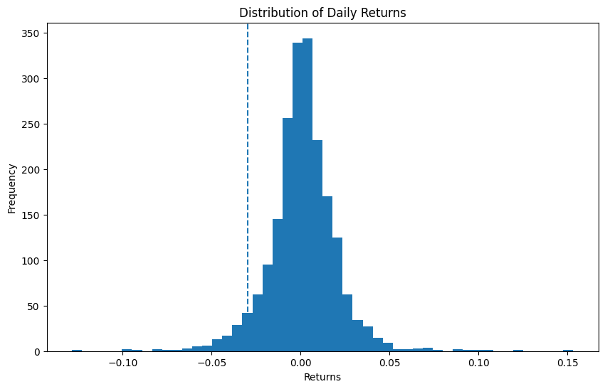

# value-at-risk-analysis
Quantitative analysis of Value-at-Risk (VaR) using Python. Features parametric and historical simulation methods to evaluate market risk for equity portfolios.
# Value-at-Risk (VaR) Analysis
Quantitative Financial Risk modeling for equity portfolios using Python.

### Simulation Results:

*The chart above illustrates the distribution of daily returns and the VaR threshold at a 95% confidence level.*

### Project Overview:
- **Methods:** Parametric and Historical Simulation.
- **Tech Stack:** Python (Pandas, Scipy, Matplotlib).
- **Asset:** AAPL (Apple Inc.) historical market data.
